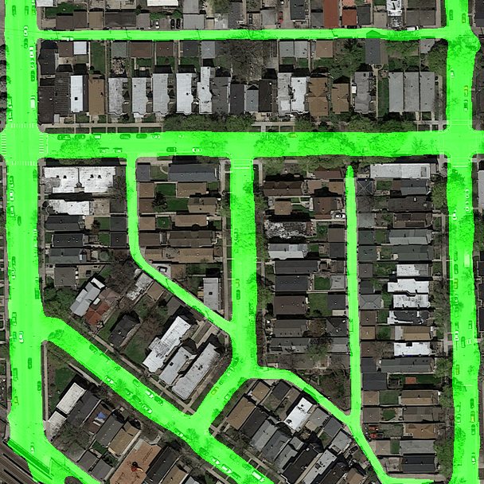
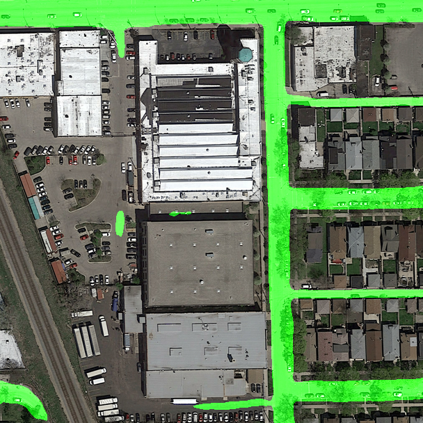

# Road Segmentation from Aerial Images Using Deep Learning

## Introduction

This repository hosts a deep learning project aimed at segmenting roads from aerial images. The primary objective is to classify each 16x16 pixel patch as 'road' or 'non-road'. The project leverages a dataset comprising training images with ground truth masks and a test set for validation. Model performance is assessed using the F1 score to balance precision and recall.

## Project Setup

### Environment

- **Platform**: Google Colab

### Dependencies

- **Python Libraries**: `numpy`, `os` for basic operations; `matplotlib`, `cv2`, `PIL` for image processing; `torch`, `pandas` for machine learning tasks
- **Segmentation Models PyTorch (SMP)**: Provides a high-level API for neural network creation. It offers nine pre-trained model architectures, including U-Net, for faster convergence. SMP simplifies the model development and training with a wide range of metrics and loss functions.
https://github.com/qubvel/segmentation_models.pytorch
- **Albumentations**: A library for diverse image transformation operations, enhancing computer vision tasks.
https://github.com/albumentations-team/albumentations
- **BayesianOptimization**: A library that implements and easy to use Bayesian Optimization framework for hyperparameter optimization. https://github.com/bayesian-optimization/BayesianOptimization

## Data Preprocessing

### Dataset Overview

- **Training Dataset**: 100 color aerial images (400x400 pixels) with corresponding ground truth masks.
- **Test Dataset**: 50 color aerial images (608x608 pixels) without ground truth masks. 

### Processing Steps

1. **Resolution Consistency**: Verified by estimating the average resolution of cars in both training and test images.
2. **Ground Truth Mask Adjustment**: Original ground truth images contained multiple grayscale values. A threshold of 120 was applied to convert these into binary masks (255 for roads, 0 for non-roads).
3. **Image Resizing**: Training images resized to 416x416 pixels to meet model requirements (divisible by 32).

## Using This Repository

- **Setup Environment**: Ready to use on Google Colab, only need to update the path to your drive directory
- **Command Board**: Parameters of training can easily be configured before training in **PARAMS** dictionnary

## Test Set Results
The model is able to accurately segment thin and curved roads. It also avoids parking lots and railroads.

    
    

